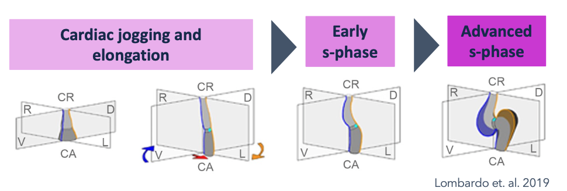
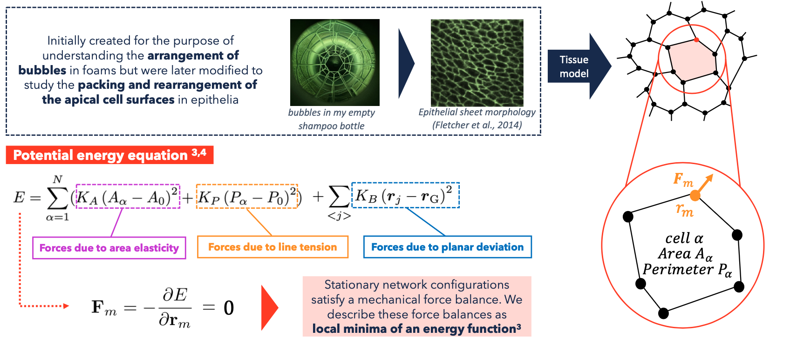
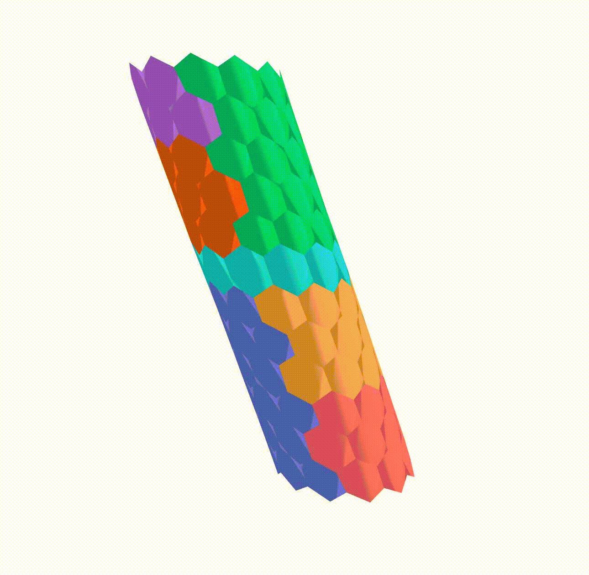

+++ 
author = "michaela.is"
title = "3D Heart Development Model"
date = "2023-06-30"
tags = [
    "Data Science",
    "Biotechnology",
    "Healthcare"
]
description = "Final Year Project: Modelling differential growth in heart tube using a vertex-based model"
+++

## Heart Looping 
Cardiac looping is a crucial process in the development of the heart, involving the transformation of a straight heart tube into a more complex curved loop. This process is characterized by several sub-processes, including ventricular bending, ventricular rotation, and displacement of embryonic heart segments along the cranio-caudal body axis. Abnormalities in heart looping process can lead to congenital heart defects, which occur in approximately 1% of live births and 10% of stillborn human births, and may also be cause of spontaneous abortions in the first trimester of pregnancy.

Over the past 30 years, much research on cardiac looping has focused on genetics and molecular signaling. Many genes and molecular signaling pathways have been identified as playing key roles in either the elongation, bending, and coiling of the tubular heart or in determining the handedness of the heart loop configuration, while the physical processes involved in the formation of the looped heart tube have not been fully understood. In recent years, researchers have begun to explore the biomechanics of this process, using a combination of modelling and experiments on various animal models, like zebrafish, which are widely used in research on heart development because they can survive even when they have severe heart defects.

Both internal and external factors have been suggested to play a role in regulating the morphogenesis of cardiac looping. Previous research suggests that the process of looping may be influenced by several mechanical factors that function independently and can have overlapping effects, potentially working together to produce the normal changes in shape of the looping embryonic heart tube.

## Vertex Model of the Heart

 In my research I implemented a *Python* algorithm using *NetworkX*, a Python library for complex network analysis, to build a 3D apical vertex model. Vertex models have been effectively employed in the field of developmental biology to study a range of phenomena, including epithelial morphogenesis in various model organisms. Using vertex models, researchers have gained insight into the crucial role that tensions at cellular interfaces play in tissue mechanics. 

 

 This model has been used to simulate the differential growth of different regions by altering the target area of the cells in these regions and observe the effect on the developing heart tube. The final simulation results can be seen below: 

