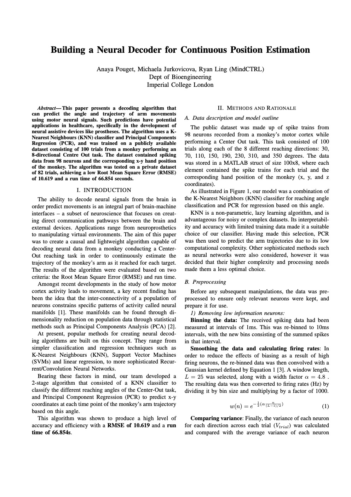
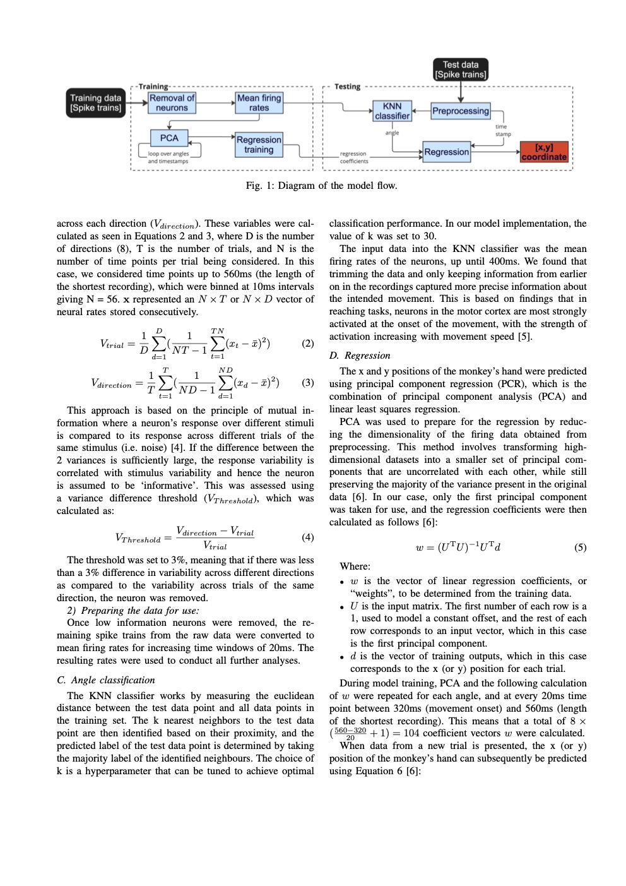
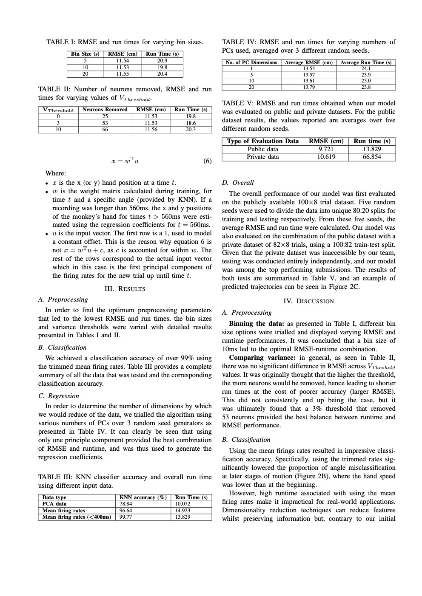
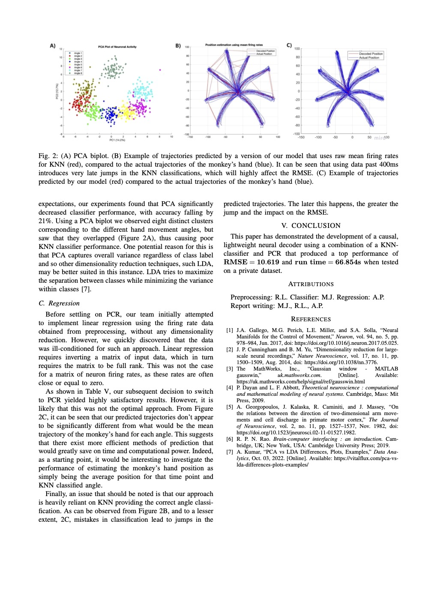

+++ 
author = "michaela.is"
title = "Neural Motion Decoder"
date = "2019-03-11"
tags = [
    "Data Science",
    "Machine Learning",
    "Biotechnology",
]
categories = [
    "themes",
    "syntax",
]
series = ["Themes Guide"]
aliases = ["migrate-from-jekyl"]
+++

NOTE: I am working on beginner frienfly article which would explain basic ML techniques used in this Neural Motion Decoder I have worked on. 

